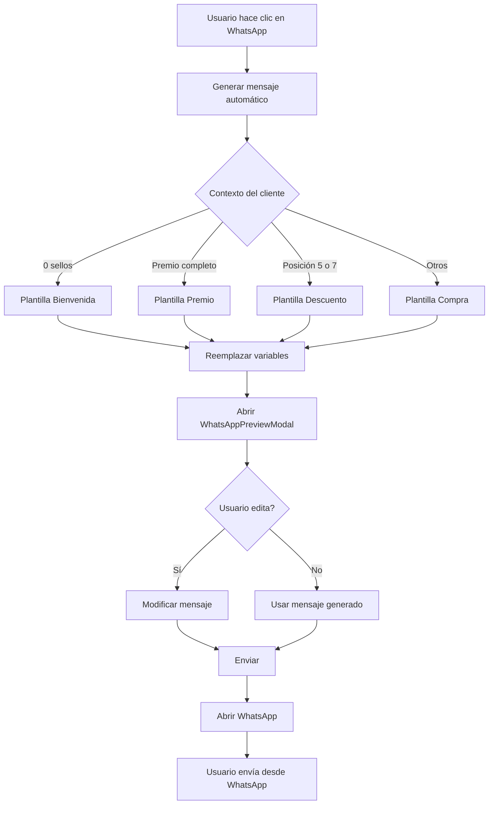

# 🎉 Sistema Completo de Plantillas WhatsApp - ACRILCARD

**Fecha:** 3 de Noviembre, 2025  
**Última Actualización:** 11 de Noviembre, 2025  
**Estado:** ✅ Implementado y Documentado Completamente

---

## 📋 Tabla de Contenidos

1. [Resumen de Cambios](#resumen-de-cambios)
2. [Nuevas Plantillas](#nuevas-plantillas)
3. [Sistema de Vista Previa](#sistema-de-vista-previa)
4. [Conexión con WhatsApp](#conexión-con-whatsapp)
5. [Panel de Gestión de Plantillas](#panel-de-gestión-de-plantillas)
6. [Flujo Completo de Envío](#flujo-completo-de-envío)
7. [Arquitectura del Sistema](#arquitectura-del-sistema)

---

## 📋 Resumen de Cambios

Se implementó la **Opción A** completa con las siguientes mejoras:

### ✅ Cambios Realizados

1. **Plantillas Actualizadas con Textos Personalizados de Acril**
2. **Sistema Totalmente Editable** (todas las plantillas pueden editarse directamente)
3. **Nueva Categoría "Descuento"** agregada
4. **Nueva Variable `{posicion}`** para indicar posición en la tarjeta
5. **Botón "Restaurar Predeterminadas"** para recuperar plantillas originales
6. **Sistema de Vista Previa Completo** con modal interactivo
7. **Conexión Directa con WhatsApp** con reutilización de ventanas
8. **Panel de Gestión Integrado** en Configuración

---

## 🆕 Nuevas Plantillas

### 1. **Bienvenida** 👋 (Cliente Nuevo)
- **ID:** `welcome`
- **Categoría:** Bienvenida
- **Descripción:** Para clientes nuevos con 0 sellos
- **Uso:** Automático al enviar a cliente sin sellos
- **Texto:** Incluye información sobre descuentos 5% en posiciones 5, 7 y premio en posición 10 + Cashea

### 2. **Compra Recurrente** 🛍️ (Cliente con Compras)
- **ID:** `stamps_added`
- **Categoría:** Compra
- **Descripción:** Cliente con compras previas
- **Uso:** Automático para clientes con sellos pero sin premio completo
- **Texto:** Avance de tarjeta con información de descuentos y premios

### 3. **Descuento 5%** 💰 (Posición 5 o 7) ⭐ NUEVA
- **ID:** `discount_5_7`
- **Categoría:** Descuento
- **Descripción:** Cuando alcanza posición 5 o 7
- **Uso:** Automático cuando `currentStamps === 5 || currentStamps === 7`
- **Texto:** Felicitación por alcanzar descuento del 5%

### 4. **Premio Completo** 🎁 (Posición 10)
- **ID:** `reward_complete`
- **Categoría:** Premio
- **Descripción:** Cuando completa la tarjeta
- **Uso:** Automático cuando `totalRewards > 0`
- **Texto:** Felicitación por premio completo (5% + obsequio)

### 5. **Recordatorio** ⏰ (Cliente Inactivo)
- **ID:** `reminder`
- **Categoría:** Recordatorio
- **Descripción:** Para clientes inactivos
- **Uso:** Manual desde el panel
- **Texto:** Recordatorio con mención a Acril economía de lujo

---

## 👁️ Sistema de Vista Previa

### Componente: `WhatsAppPreviewModal.jsx`

El sistema incluye un **modal completo de vista previa** que permite revisar y editar el mensaje antes de enviarlo.

#### Características del Modal

1. **Vista Previa en Tiempo Real**
   ```javascript
   // Muestra el mensaje con formato de WhatsApp
   <div className="bg-gradient-to-br from-green-50 to-green-100">
     <div className="bg-white rounded-lg p-4 shadow-sm">
       <pre className="whitespace-pre-wrap font-sans">
         {message}
       </pre>
     </div>
   </div>
   ```

2. **Selector de Plantillas Integrado**
   - Desplegable con todas las plantillas disponibles
   - Categorización visual con iconos
   - Indicador de plantillas predeterminadas
   - Vista previa de primeras líneas

3. **Modo de Edición**
   - Textarea de 8 filas para editar mensaje
   - Contador de caracteres en tiempo real
   - Validación de variables
   - Botón "Guardar" para confirmar cambios

4. **Información del Cliente**
   - Nombre del cliente
   - Teléfono formateado (+58 XXX XXX XXXX)
   - Datos contextuales

5. **Funciones Adicionales**
   - **Copiar mensaje**: Copia al portapapeles
   - **Editar**: Activa/desactiva modo edición
   - **Enviar**: Abre WhatsApp con el mensaje

#### Flujo de Vista Previa

```
1. Usuario hace clic en botón WhatsApp
   ↓
2. Sistema genera mensaje automático según contexto
   ↓
3. Se abre WhatsAppPreviewModal
   ↓
4. Usuario puede:
   - Ver mensaje generado
   - Seleccionar otra plantilla
   - Editar manualmente
   - Copiar mensaje
   ↓
5. Usuario hace clic en "Enviar"
   ↓
6. Sistema abre WhatsApp con mensaje final
```

#### Datos de Ejemplo para Vista Previa

```javascript
const previewData = {
  customerName: 'Juan Pérez',
  businessName: 'ACRIL Pinturas',
  totalStamps: 17,
  stampsPerReward: 10,
  currentStamps: 7,
  totalRewards: 1,
  link: 'https://acrilcard.netlify.app/card?c=CLI-001'
};
```

---

## 📱 Conexión con WhatsApp

### Función Principal: `enviarTarjetaPorWhatsApp()`

Ubicación: `src/utils/whatsapp.js`

#### Parámetros de Entrada

```javascript
enviarTarjetaPorWhatsApp(telefonoCliente, nombreCliente, idCliente, {
  customMessage: string,        // Mensaje personalizado (NUEVO)
  customerCode: string,         // Código del cliente
  stamps: number,              // Sellos totales
  stampsPerReward: number,     // Sellos por premio
  purchaseHistory: Array,      // Historial de compras
  businessName: string,        // Nombre del negocio
  baseUrl: string,            // URL base (opcional)
  countryCode: string         // Código de país (opcional)
})
```

#### Proceso de Conexión

```javascript
// 1. Detectar plataforma
const isDesktop = /Windows|Macintosh|Linux/i.test(ua) && !/Mobile/i.test(ua);
const isAndroid = /Android/i.test(ua);
const isIOS = /iPhone|iPad|iPod/i.test(ua);

// 2. Construir URL según plataforma
if (isDesktop) {
  targetUrl = `https://web.whatsapp.com/send?phone=${numeroWhatsApp}&text=${mensaje}`;
} else {
  targetUrl = `https://api.whatsapp.com/send?phone=${numeroWhatsApp}&text=${mensaje}`;
}

// 3. Reutilizar ventana existente o abrir nueva
if (whatsappWindow && !whatsappWindow.closed) {
  whatsappWindow.location.href = targetUrl;
  whatsappWindow.focus();
} else {
  whatsappWindow = window.open(targetUrl, 'whatsapp_acrilcard');
}
```

#### Características de la Conexión

1. **Reutilización de Ventanas** ⭐ OPTIMIZADO
   ```javascript
   // Guarda referencia global a la ventana
   let whatsappWindow = null;
   
   // Reutiliza la misma ventana en múltiples envíos
   window.open(targetUrl, 'whatsapp_acrilcard');
   ```

2. **Detección Inteligente de Plataforma**
   - Desktop → WhatsApp Web
   - Android → WhatsApp App (con intent para Business)
   - iOS → WhatsApp App
   - Fallback general

3. **Normalización de Números**
   ```javascript
   // Soporta múltiples países
   const COUNTRY_CONFIGS = {
     VE: { code: '58', phoneLength: 10 },
     MX: { code: '52', phoneLength: 10 },
     CO: { code: '57', phoneLength: 10 },
     // ... más países
   };
   ```

4. **Manejo de Errores**
   - Bloqueador de pop-ups detectado
   - Opción de copiar enlace al portapapeles
   - Mensajes de error descriptivos

---

## ⚙️ Panel de Gestión de Plantillas

### Componente: `WhatsAppTemplateManager.jsx`

Ubicación: `src/components/WhatsAppTemplateManager.jsx`  
Acceso: **Configuración → Plantillas de WhatsApp**

#### Estructura del Panel

```
┌─────────────────────────────────────────────────────┐
│  📱 Plantillas de WhatsApp                          │
│  [Estadísticas] [Restaurar] [+ Nueva Plantilla]    │
├─────────────────────────────────────────────────────┤
│  📋 Filtros: [Todas] [👋] [🛍️] [💰] [🎁] [⏰]      │
├─────────────────────────────────────────────────────┤
│  📝 Variables Disponibles                           │
│  {nombre} {sellos} {posicion} {link} ...            │
├─────────────────────────────────────────────────────┤
│  ┌─────────────────┐  ┌─────────────────┐          │
│  │ Bienvenida 👋   │  │ Compra 🛍️       │          │
│  │ Predeterminada  │  │ Predeterminada  │          │
│  │ [Usar] [👁️] [✏️]│  │ [Usar] [👁️] [✏️]│          │
│  └─────────────────┘  └─────────────────┘          │
└─────────────────────────────────────────────────────┘
```

#### Funcionalidades del Panel

1. **Gestión de Plantillas**
   - ✅ Crear nueva plantilla personalizada
   - ✅ Editar plantillas existentes (incluidas predeterminadas)
   - ✅ Eliminar plantillas personalizadas
   - ✅ Restaurar plantillas predeterminadas

2. **Filtros por Categoría**
   ```javascript
   const categories = [
     { id: 'all', name: 'Todas', icon: '📋' },
     { id: 'welcome', name: 'Bienvenida', icon: '👋' },
     { id: 'purchase', name: 'Compra', icon: '🛍️' },
     { id: 'discount', name: 'Descuento', icon: '💰' },
     { id: 'reward', name: 'Premio', icon: '🎁' },
     { id: 'reminder', name: 'Recordatorio', icon: '⏰' },
     { id: 'custom', name: 'Personalizado', icon: '✨' }
   ];
   ```

3. **Vista Previa Integrada**
   - Modal con datos de ejemplo
   - Reemplazo de variables en tiempo real
   - Vista simulada de WhatsApp

4. **Validación en Tiempo Real**
   ```javascript
   // Valida variables mientras editas
   const validation = validateTemplateVariables(template.message);
   if (!validation.valid) {
     // Muestra alerta con variables inválidas
   }
   ```

5. **Estadísticas de Uso**
   ```javascript
   // Muestra cuántas veces se ha usado cada plantilla
   {
     "welcome": { count: 45, lastUsed: "2025-11-03T10:30:00Z" },
     "stamps_added": { count: 123, lastUsed: "2025-11-03T11:15:00Z" }
   }
   ```

6. **Almacenamiento**
   ```javascript
   // Guarda en localStorage
   localStorage.setItem('whatsapp_templates', JSON.stringify(templates));
   
   // Carga con fallback automático
   const templates = getAllTemplates(); // Retorna guardadas o predeterminadas
   ```

#### Acciones Disponibles por Plantilla

| Acción | Icono | Descripción |
|--------|-------|-------------|
| **Usar** | - | Selecciona la plantilla para envío |
| **Vista Previa** | 👁️ | Abre modal con vista previa |
| **Copiar** | 📋 | Copia mensaje al portapapeles |
| **Editar** | ✏️ | Activa modo edición |
| **Eliminar** | 🗑️ | Elimina plantilla (solo personalizadas) |

---

## 🔄 Flujo Completo de Envío

### Desde CustomerDetails.jsx

```
1. Usuario hace clic en botón "WhatsApp" 📱
   ↓
2. generateWhatsAppMessage() se ejecuta
   │
   ├─ Detecta contexto del cliente:
   │  • isNewCustomer (0 sellos) → plantilla 'welcome'
   │  • hasReward (premio completo) → plantilla 'reward_complete'
   │  • isAtDiscount (pos 5 o 7) → plantilla 'discount_5_7'
   │  • default → plantilla 'stamps_added'
   │
   ├─ Carga plantillas: getAllTemplates()
   │
   ├─ Selecciona plantilla apropiada
   │
   ├─ Prepara datos para reemplazo:
   │  {
   │    nombre: customer.name,
   │    sellos: totalStamps,
   │    posicion: currentStamps,
   │    link: linkTarjeta,
   │    ...
   │  }
   │
   └─ Reemplaza variables: replaceTemplateVariables()
   ↓
3. Se abre WhatsAppPreviewModal
   │
   ├─ Muestra mensaje generado
   ├─ Permite edición
   ├─ Muestra selector de plantillas
   └─ Botón "Enviar por WhatsApp"
   ↓
4. Usuario hace clic en "Enviar"
   ↓
5. handleSendWhatsApp() ejecuta enviarTarjetaPorWhatsApp()
   │
   ├─ Normaliza número de teléfono
   ├─ Detecta plataforma (Desktop/Mobile)
   ├─ Construye URL de WhatsApp
   ├─ Reutiliza ventana existente o abre nueva
   └─ Registra en historial
   ↓
6. WhatsApp se abre con mensaje pre-llenado
   ↓
7. Usuario envía desde WhatsApp
```

### Diagrama de Flujo



---

## 🏗️ Arquitectura del Sistema

### Módulos y Responsabilidades

```
src/
├── components/
│   ├── WhatsAppTemplateManager.jsx    # Panel de gestión
│   ├── WhatsAppPreviewModal.jsx       # Modal de vista previa
│   ├── CustomerDetails.jsx            # Integración con clientes
│   └── Settings.jsx                   # Acceso al panel
│
├── utils/
│   ├── whatsapp.js                    # Conexión con WhatsApp
│   ├── whatsappTemplates.js           # Plantillas centralizadas
│   ├── templateVariables.js           # Manejo de variables
│   └── customerDataEncoder.js         # Codificación de datos
│
└── contexts/
    └── NotificationContext.js         # Notificaciones de éxito/error
```

### Flujo de Datos

```
WhatsAppTemplateManager (Panel)
    ↓ (edita/crea)
localStorage ('whatsapp_templates')
    ↓ (lee)
getAllTemplates() (whatsappTemplates.js)
    ↓ (usa)
CustomerDetails.jsx
    ↓ (genera mensaje)
replaceTemplateVariables() (templateVariables.js)
    ↓ (muestra)
WhatsAppPreviewModal
    ↓ (envía)
enviarTarjetaPorWhatsApp() (whatsapp.js)
    ↓ (abre)
WhatsApp Web/App
```

### Almacenamiento

```javascript
// localStorage keys
{
  'whatsapp_templates': [...]      // Plantillas guardadas
  'template_stats': {...}          // Estadísticas de uso
  'whatsapp_business_name': '...'  // Nombre del negocio
}
```

---

## 🔧 Cambios Técnicos

### Archivos Modificados

#### 1. `src/components/WhatsAppTemplateManager.jsx`

**Cambios:**
- ✅ Actualizado array `defaultTemplates` con 5 plantillas personalizadas
- ✅ Agregada categoría "Descuento" en el array `categories`
- ✅ Modificada función `saveTemplates()` para guardar TODAS las plantillas
- ✅ Agregada función `handleRestoreDefaults()` para restaurar plantillas
- ✅ Modificada función `handleEditTemplate()` para permitir edición directa
- ✅ Actualizada función `handleDeleteTemplate()` con mejor mensaje
- ✅ Agregado botón "Restaurar Predeterminadas" en la UI

#### 2. `src/utils/templateVariables.js`

**Cambios:**
- ✅ Agregada variable `{posicion}` en función `replaceTemplateVariables()`
- ✅ Agregada `{posicion}` a la lista de variables válidas
- ✅ Agregada `{posicion}` a la documentación de variables disponibles

---

## 📊 Variables Disponibles

| Variable | Descripción | Ejemplo |
|----------|-------------|---------|
| `{nombre}` | Nombre del cliente | Juan Pérez |
| `{negocio}` | Nombre del negocio | ACRIL Pinturas |
| `{sellos}` | Sellos totales | 15 |
| `{sellosEnTarjeta}` | Sellos en tarjeta actual | 5 |
| `{posicion}` | Posición en la tarjeta | 5 |
| `{sellosFaltantes}` | Sellos faltantes para premio | 5 |
| `{stampsPerReward}` | Sellos necesarios por premio | 10 |
| `{premios}` | Premios disponibles | 1 |
| `{link}` | Link a la tarjeta | https://... |
| `{monto}` | Monto de compra | $1,500 |
| `{fecha}` | Fecha actual | 27/10/2025 |

---

## 🎯 Funcionalidades Nuevas

### 1. **Edición Directa de Plantillas Predeterminadas**

**Antes:**
- ❌ No se podían editar plantillas predeterminadas
- ❌ Solo se podía crear una copia personalizada

**Ahora:**
- ✅ Todas las plantillas son editables directamente
- ✅ Los cambios se guardan automáticamente
- ✅ Se pueden restaurar las originales con un botón

### 2. **Botón "Restaurar Predeterminadas"**

**Ubicación:** Header del gestor de plantillas  
**Función:** Restaura todas las plantillas a su estado original  
**Confirmación:** Requiere confirmación del usuario antes de ejecutar

### 3. **Nueva Categoría "Descuento"**

**Icono:** 💰  
**Uso:** Para plantillas relacionadas con descuentos en posiciones 5 y 7  
**Filtro:** Disponible en el filtro de categorías

---

## 🧪 Cómo Probar el Sistema Completo

### Paso 1: Acceder al Gestor de Plantillas

1. Iniciar sesión con credenciales de admin: `admin / admin123`
2. Ir a **Configuración** (⚙️) en el menú lateral
3. Scroll hasta la sección **"Plantillas de WhatsApp"**

### Paso 2: Verificar Panel de Gestión

1. Verificar que hay **5 plantillas** predeterminadas
2. Verificar que existe la categoría **"Descuento"** 💰
3. Verificar los textos personalizados de Acril
4. Probar filtros por categoría (👋, 🛍️, 💰, 🎁, ⏰)
5. Verificar panel de **Variables Disponibles**

### Paso 3: Probar Edición de Plantillas

1. Hacer clic en el botón **"Editar"** (✏️) de cualquier plantilla
2. Modificar el texto del mensaje
3. Observar validación en tiempo real de variables
4. Hacer clic en **"Guardar"**
5. Verificar que los cambios se guardaron correctamente

### Paso 4: Probar Vista Previa en Panel

1. Hacer clic en el botón **"👁️"** de cualquier plantilla
2. Verificar que se abre modal con vista previa
3. Verificar que se muestran datos de ejemplo:
   - Nombre: Juan Pérez
   - Sellos: 17
   - Premios: 1
4. Verificar que la variable `{posicion}` se reemplaza correctamente
5. Cerrar modal

### Paso 5: Probar Envío desde Cliente

1. Ir a la vista de **Clientes**
2. Seleccionar un cliente de la lista
3. Hacer clic en botón **"WhatsApp"** 📱
4. Verificar que se abre **WhatsAppPreviewModal**
5. Observar mensaje generado automáticamente según contexto
6. Probar selector de plantillas desplegable
7. Seleccionar otra plantilla y ver cambio en tiempo real
8. Activar modo edición y modificar mensaje
9. Copiar mensaje al portapapeles
10. Hacer clic en **"Enviar por WhatsApp"**
11. Verificar que se abre WhatsApp Web/App con mensaje

### Paso 6: Probar Reutilización de Ventanas

1. Enviar mensaje a un cliente
2. Cerrar modal (sin cerrar ventana de WhatsApp)
3. Enviar mensaje a otro cliente
4. Verificar que **reutiliza la misma pestaña** de WhatsApp
5. No deberían abrirse múltiples pestañas

### Paso 7: Probar Restauración

1. Editar varias plantillas
2. Hacer clic en **"Restaurar Predeterminadas"**
3. Confirmar la acción en el diálogo
4. Verificar que las plantillas volvieron a su estado original
5. Verificar mensaje de éxito: "✅ Plantillas predeterminadas restauradas correctamente"

### Paso 8: Probar Estadísticas

1. En el panel de plantillas, hacer clic en **"Estadísticas"**
2. Verificar que se muestran contadores de uso
3. Enviar varios mensajes usando diferentes plantillas
4. Recargar panel y verificar que contadores aumentaron

---

## ✅ Checklist de Verificación Completo

### Panel de Gestión
- [ ] Servidor de desarrollo inicia sin errores
- [ ] Las 5 plantillas nuevas aparecen correctamente
- [ ] La categoría "Descuento" 💰 está disponible
- [ ] Los textos incluyen "Acril economía de lujo" y "Cashea"
- [ ] Filtros por categoría funcionan correctamente
- [ ] Panel de variables disponibles se muestra
- [ ] El botón "Editar" funciona en todas las plantillas
- [ ] Los cambios se guardan correctamente en localStorage
- [ ] El botón "Restaurar Predeterminadas" funciona
- [ ] Validación en tiempo real de variables funciona
- [ ] Estadísticas de uso se muestran correctamente

### Vista Previa en Panel
- [ ] Modal de vista previa se abre correctamente
- [ ] Datos de ejemplo se muestran (Juan Pérez, 17 sellos)
- [ ] La variable `{posicion}` se reemplaza correctamente
- [ ] Todas las variables se reemplazan correctamente
- [ ] Modal se cierra sin errores

### Sistema de Envío
- [ ] WhatsAppPreviewModal se abre desde CustomerDetails
- [ ] Mensaje se genera automáticamente según contexto del cliente
- [ ] Selector de plantillas desplegable funciona
- [ ] Cambio de plantilla actualiza mensaje en tiempo real
- [ ] Modo edición permite modificar mensaje
- [ ] Contador de caracteres funciona
- [ ] Botón "Copiar" copia mensaje al portapapeles
- [ ] Botón "Enviar" abre WhatsApp correctamente

### Conexión con WhatsApp
- [ ] WhatsApp Web se abre en desktop
- [ ] WhatsApp App se abre en móvil
- [ ] Mensaje pre-llenado aparece correctamente
- [ ] Número de teléfono se normaliza correctamente
- [ ] Link de tarjeta es correcto (formato: /card?c=CLI-XXX)
- [ ] Reutilización de ventanas funciona (no múltiples pestañas)
- [ ] Manejo de bloqueador de pop-ups funciona

### Selección Automática de Plantillas
- [ ] Cliente con 0 sellos → Plantilla "Bienvenida"
- [ ] Cliente con premio completo → Plantilla "Premio Completo"
- [ ] Cliente en posición 5 o 7 → Plantilla "Descuento 5%"
- [ ] Cliente con sellos (otros casos) → Plantilla "Compra Recurrente"

### Consola y Errores
- [ ] No hay errores en la consola del navegador
- [ ] Logs de debug muestran información correcta
- [ ] No hay warnings de React
- [ ] No hay errores de red

---

## 🚀 Próximos Pasos

### Para Desarrollo Local:
```bash
# El servidor ya está corriendo
# Acceder a: http://localhost:3000
```

### Para Producción:
```bash
# 1. Hacer build
npm run build

# 2. Desplegar a GitHub Pages
npm run deploy
```

---

## 📝 Notas Importantes

### Almacenamiento
- Las plantillas editadas se guardan en `localStorage`
- Clave: `whatsapp_templates`
- Las plantillas predeterminadas se pueden restaurar en cualquier momento

### Compatibilidad
- ✅ Compatible con el sistema existente de envío de WhatsApp
- ✅ Todas las variables funcionan correctamente
- ✅ No rompe funcionalidad existente

### Seguridad
- ✅ Validación de variables en tiempo real
- ✅ Confirmación antes de restaurar plantillas
- ✅ Mensajes de error claros para el usuario

---

## 🐛 Solución de Problemas

### Problema: Las plantillas no se guardan
**Solución:** Verificar que localStorage esté habilitado en el navegador

### Problema: La variable {posicion} no se reemplaza
**Solución:** Verificar que `templateVariables.js` esté actualizado correctamente

### Problema: No aparece el botón "Restaurar Predeterminadas"
**Solución:** Limpiar caché del navegador y recargar

---

## 📞 Soporte

Si encuentras algún problema:
1. Verificar la consola del navegador (F12)
2. Revisar que todos los archivos estén guardados
3. Reiniciar el servidor de desarrollo

---

**Implementado por:** Cascade AI  
**Versión:** 1.0  
**Última actualización:** 3 de Noviembre, 2025
