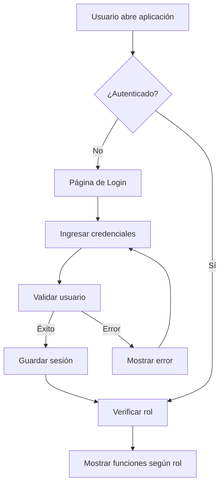

# 🔐 Sistema de Autenticación - ACRILCARD

## 📋 Resumen
Se ha implementado un sistema completo de autenticación con roles para **ACRILCARD** que permite controlar el acceso basado en permisos de usuario.

## 🏗️ Arquitectura Implementada

### **Componentes Creados:**

#### 1. **AuthContext** (`src/contexts/AuthContext.js`)
- ✅ Gestión centralizada de autenticación
- ✅ Persistencia en localStorage
- ✅ Sistema de roles jerárquico
- ✅ Funciones de login/logout
- ✅ Verificación de permisos

#### 2. **LoginForm** (`src/components/LoginForm.jsx`)
- ✅ Formulario de login responsive
- ✅ Selección visual de roles
- ✅ Validación de formularios
- ✅ Feedback visual de errores
- ✅ Credenciales de prueba incluidas

#### 3. **ProtectedRoute** (`src/components/ProtectedRoute.jsx`)
- ✅ Control de acceso por rutas
- ✅ Verificación de roles específicos
- ✅ Pantallas de error personalizadas
- ✅ Loading states
- ✅ Redirección automática

#### 4. **Navigation Actualizada** (`src/components/common/Navigation.jsx`)
- ✅ Información del usuario autenticado
- ✅ Funciones condicionales por rol
- ✅ Botón de logout funcional
- ✅ Badge de rol del usuario

#### 5. **MainApp** (`src/MainApp.jsx`)
- ✅ Lógica de negocio preservada
- ✅ Integración con autenticación
- ✅ Rutas protegidas

#### 6. **App.js Simplificado** (`src/App.js`)
- ✅ Provider de autenticación
- ✅ Routing con protección
- ✅ Separación de responsabilidades

## 👥 Sistema de Roles

### **Roles Disponibles:**

#### 🔴 **Administrador** (`admin`)
- **Acceso completo** a todas las funciones
- **Configuración del sistema** (sellos por premio)
- **Importación/Exportación** de datos
- **Corrección de prefijos** de IDs
- **Acceso a página de testing**
- **Gestión completa** de clientes

#### 🔵 **Empleado** (`employee`)
- **Gestión básica** de clientes
- **Agregar nuevos** clientes
- **Gestionar sellos** por compras
- **Enviar tarjetas** por WhatsApp
- **Acceso restringido** a funciones administrativas

### **Credenciales de Prueba:**

```javascript
// Administrador
Usuario: admin
Contraseña: admin123

// Empleado
Usuario: empleado
Contraseña: empleado123
```

## 🔧 Cómo Usar el Sistema

### **1. Login Inicial:**
1. Al abrir la aplicación, se redirige automáticamente a `/login`
2. Selecciona el tipo de usuario (Admin/Empleado)
3. Ingresa las credenciales correspondientes
4. Haz clic en "Iniciar Sesión"

### **2. Información del Usuario:**
- En la barra de navegación superior se muestra:
  - Avatar con inicial del nombre
  - Nombre completo del usuario
  - Email del usuario
  - Badge con el rol actual

### **3. Funciones por Rol:**

#### **Para Administradores:**
- ✅ Configuración de "Sellos para premio"
- ✅ Menú de importación de datos JSON
- ✅ Función de "Corregir prefijos"
- ✅ Exportar datos a JSON
- ✅ Acceso a página de testing (`/test-errors`)

#### **Para Empleados:**
- ✅ Todas las funciones de gestión de clientes
- ✅ Envío de tarjetas por WhatsApp
- ❌ Sin acceso a configuración del sistema
- ❌ Sin acceso a funciones administrativas

### **4. Logout:**
- Haz clic en "Cerrar sesión" en la barra de navegación
- Se limpia la sesión automáticamente
- Se redirige al formulario de login

## 🛡️ Seguridad Implementada

### **Control de Acceso:**
- ✅ Rutas protegidas por autenticación
- ✅ Verificación de roles por función
- ✅ Pantallas de error personalizadas
- ✅ Redirección automática no autorizados

### **Persistencia:**
- ✅ Sesión guardada en localStorage
- ✅ Recuperación automática al recargar
- ✅ Limpieza segura al hacer logout

### **Validación:**
- ✅ Validación de formularios
- ✅ Verificación de credenciales
- ✅ Feedback de errores en tiempo real

## 📱 Experiencia de Usuario

### **Pantalla de Login:**
- Diseño moderno y responsive
- Selección visual de roles
- Validación en tiempo real
- Loading states durante autenticación
- Credenciales de prueba visibles

### **Navegación:**
- Información clara del usuario autenticado
- Funciones contextuales según el rol
- Logout funcional e intuitivo
- Diseño consistente con la aplicación

### **Control de Acceso:**
- Mensajes de error claros y útiles
- Redirección automática
- Estados de carga apropiados
- Navegación fluida

## 🔄 Flujo de Autenticación



## 🚀 Beneficios del Sistema

### **Para el Negocio:**
- ✅ **Control de acceso** granular
- ✅ **Seguridad** mejorada
- ✅ **Auditoría** de acciones por usuario
- ✅ **Diferentes niveles** de responsabilidad

### **Para Usuarios:**
- ✅ **Interfaz intuitiva** y moderna
- ✅ **Acceso personalizado** según rol
- ✅ **Experiencia consistente**
- ✅ **Seguridad** de datos

### **Para Desarrolladores:**
- ✅ **Arquitectura escalable**
- ✅ **Reutilización** de componentes
- ✅ **Mantenimiento** fácil
- ✅ **Testing** independiente

## 📋 Funcionalidades Implementadas

### ✅ **Completadas:**
- [x] Sistema de autenticación completo
- [x] Login con selección de roles
- [x] Rutas protegidas por rol
- [x] Persistencia de sesión
- [x] Logout funcional
- [x] Información del usuario en navegación
- [x] Control de permisos granular
- [x] Validación de formularios
- [x] Estados de carga y error
- [x] Diseño responsive

### 🔄 **Próximas Mejoras (Opcionales):**
- [ ] Recuperación de contraseña
- [ ] Gestión de usuarios desde admin
- [ ] Logs de auditoría
- [ ] Sesiones múltiples
- [ ] Bloqueo por intentos fallidos

## 🎯 Resultado Final

El sistema de autenticación está **completamente funcional** y listo para usar. Los usuarios pueden:

1. **Iniciar sesión** con credenciales específicas por rol
2. **Acceder a funciones** según sus permisos
3. **Ver información** de su perfil en la navegación
4. **Cerrar sesión** de forma segura
5. **Recuperar automáticamente** su sesión al recargar

**¡El botón de "Cerrar sesión" ahora tiene utilidad completa!** 🎉

---

*Documentación del Sistema de Autenticación - ACRILCARD*
